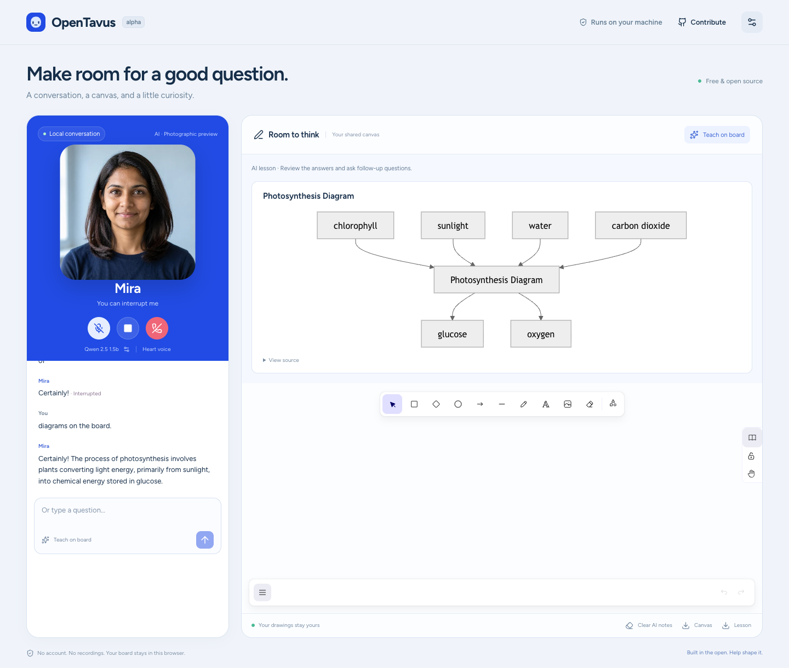

# OpenTavus

[](https://github.com/asb108/opentavus/actions/workflows/core.yml)

An open-source AI companion you can talk to, learn with, and build on. It runs local speech and language models, animates a character as it speaks, and shares a drawing board with you. No API key or subscription is required.

**Current product: local alpha on `main`.** You can try the conversation, independent model/voice/character settings, photographic Mira, and teaching board now. The earlier `v0.1.0-alpha.1` tag preserves its original preview. This is an early single-user application. Response speed and generated lesson quality still vary; the full v0.1 [quality targets](docs/quality.md) remain open.

| Try it | What it does |
| --- | --- |
| Talk or type | Local Whisper recognition, streaming Qwen replies, and Kokoro speech. Use Stop to interrupt queued audio immediately. |
| Meet Mira | A fictional photographic human with prepared head movement, blinking, listening and expression cues. Mouth movement follows played audio, and Stop closes it immediately. No NVIDIA avatar server is required. |
| Make it yours | Choose installed Qwen sizes, four English preset voices, and photographic, static, 3D or cartoon characters independently. Changes apply to the next call. |
| Teach on board | Ask directly for a note, formula, process flowchart, or practice question. Explicit drawing requests work with Teach mode off. Draw alongside the AI, keep your edits, and export a canvas PNG or lesson Markdown. |
| Build in the open | Typed engine interfaces, generated Python/browser schemas, focused behavior tests, and contributor checks that work without model downloads. |



[Watch the actual voice-and-portrait preview](docs/releases/photographic-human-preview.webm).
This short capture uses real local Qwen/Kokoro speech at normal speed. Mira's
motion comes from a finite prepared set; precise phoneme lip-sync and fully
natural emotional behavior remain open. The [measured evidence](docs/releases/photographic-human-evidence.json)
records the checks and their limits.

## Try the local app

The live reference machine is an Apple M3 Pro with 18 GB of memory, using Chrome. Linux/other Macs can try the CPU adapters, but their live performance has not been validated. English is the first speech profile. Read the [guide without NVIDIA](docs/quickstarts/low-spec.md) for smaller-model and graphics choices. Prepared photographic playback is included; custom GLB/VRM imports, live neural video, LAM, GPU workers, and Internet hosting have separate acceptance work.

Install **Python 3.12, Node.js 22.12+, [uv](https://docs.astral.sh/uv/getting-started/installation/), and [Ollama](https://ollama.com/download)**. Start Ollama before installing the models. Allow at least **5 GB of free storage** for dependencies and the default models; existing dependencies and caches change the total.

```sh
git clone https://github.com/asb108/opentavus.git
cd opentavus
make setup
make models
make doctor
make run
```

Open **[http://127.0.0.1:8765](http://127.0.0.1:8765)** in Chrome. Type a question to try a reply without microphone access. Start conversation for microphone input; headphones are recommended while speaker echo behavior is still being evaluated. The first call warms the speech models and can take tens of seconds. Keep the server running to reuse them.

New settings select **Mira · Photographic preview**. Existing character choices
are preserved; select Mira in **Companion settings → Character** before the next
call. Static portrait mode uses only a still image. Avatar loading failure shows
that portrait and a recovery message while the conversation remains usable.

Try “What is two plus two?” Then ask “Draw the photosynthesis process on the board.” You can also say the topic first, followed by “diagrams on the board,” and ask about its arrows. **Teach on board** optionally adds lessons to general questions; an explicit drawing request needs no toggle. For a formula and quiz, try “Teach Newton's second law with F=ma and a practice question about which equation describes it.” The small default model can make mistakes. Review the lesson or try a larger installed model.

The [board repair evidence](docs/releases/board-repair-evidence.json) records real
typed and synthetic-microphone checks. The current generated flowchart format is
inputs → process → outputs; arbitrary branching diagrams remain future work.

Setup downloads pinned Whisper tiny and Kokoro artifacts with SHA-256 checks, then the reviewed `qwen2.5:1.5b` Ollama model. Model downloads are explicit. After installation, inference runs on your machine. For recovery, additional models, development mode, data deletion, and exact commands, read the [local quickstart](docs/quickstarts/local.md).

## Contribute without downloading models

```sh
make setup
make check
make demo
make base-check
```

These checks cover the API/runtime with fake engines, cancellation and playback behavior, safe teaching tools, ownership of drawings, generated contracts, strict types, formatting, and the production frontend build. They need no model server, paid service, or GPU. `make base-check` uses a separate environment to prove the core works with every plugin absent.

Start with [CONTRIBUTING.md](CONTRIBUTING.md), the [style guide](docs/style-guide.md), and [small contribution ideas](docs/contribution-guide.md). A focused bug fix or better failure message is useful; you do not need to implement an entire roadmap task. Humans and coding agents follow [AGENTS.md](AGENTS.md) and the same review rules. Issues and pull requests have templates.

## Models, privacy, and scope

The curated Qwen weights and Kokoro model use Apache-2.0 terms; Whisper uses MIT. Exact revisions, voice restrictions, and runtime notices are recorded in the [model matrix](docs/models.md) and [third-party notices](THIRD_PARTY_NOTICES.md). Optional dependencies retain their own licenses, including the eSpeak NG runtime used for phonemization. The application code is [Apache-2.0](LICENSE).

The server binds to loopback. It keeps call context in memory, does not save recordings or transcripts by default, and drops server call history when a call ends. The visible transcript stays in the page until it is refreshed. Drawings and settings are stored in this browser; formula/diagram/quiz cards currently last for the page session. Use exports before refreshing. The app is intended for trusted local use; [security reporting](SECURITY.md) documents that boundary.

Mira's selected source portrait was created once with the built-in OpenAI image
generator, as explicitly requested by the project owner. That generator is
proprietary. No OpenAI key or hosted image service is used by the installed app.
The [asset provenance and exact prompt](assets/stock/photographic/README.md)
also retain a locally generated FLUX.2 Klein 4B source and an [open-model preparation recipe](benchmarks/portrait/prepared/README.md).
LivePortrait's reviewed MIT core prepared the motion without InsightFace or actor
media. The prepared files are offered under CC0 to the extent of held rights;
engine and model licenses remain separate. The browser downloads about 3 MB of
frames, with approximately 81 MiB of decoded image storage; source images and
preparation models stay out of browser assets.

LAM is a separately planned, removable plugin. Nothing in the base app installs
or imports LAM, Blender or reconstruction weights. Its unresolved photo-weight
terms remain visible in the [plugin contract](docs/plugin-contract.md). The
optional stock 3D human uses a pinned CC0 asset and a lazy browser renderer, with
[measured preview evidence](docs/releases/browser-human-evidence.json). It remains
labeled 3D; the photographic preview supplies the current human appearance.

The first [Mac human-portrait experiment](benchmarks/portrait/mac/README.md)
generated actual frames with MLX on the M3 Pro GPU at about 5.3 FPS. It missed the
25 FPS live target and remains separate from the app. Its dependencies and research
faces are excluded from the default installation. Prepared browser playback avoids
that experiment's live-inference cost; it does not establish a live neural-video
or precise lip-sync claim.

## Project map

- [Current design](docs/design.md) and [decisions](docs/decisions.md): implemented boundaries and future direction.
- [Roadmap](docs/roadmap.md): work, dependencies, ownership, acceptance criteria, and evidence.
- [Plugin contract](docs/plugin-contract.md): add an engine without coupling the core to its packages.
- [Quality gates](docs/quality.md) and [alpha release notes](docs/releases/0.1.0-alpha.1.md): measured behavior and remaining targets.
- [Code of conduct](CODE_OF_CONDUCT.md) and [governance](GOVERNANCE.md): participation and review.

Edit `docs/tasks.json`, then run `make plan-render` and `make plan-check`. The plan verifier checks documents and the task graph; it does not establish live model performance. Historical source research is in [the plan review](docs/plan-review.md).

OpenTavus is an independent project and is not affiliated with Tavus.
