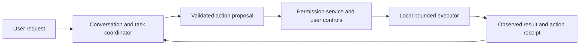

# Future personal-assistant computer use

Later capability / T30, after the first interaction release. The current app has no computer
executor or general shell/file/browser-control capability. This document reserves
the architectural boundary so later work does not disrupt human–AI interaction.
Teaching and computer assistance are independent capabilities of the same companion.

## Execution path

A model proposes an action through an installed capability. The permission
service checks the user-granted scope before the local executor acts. The
coordinator reports observed results and keeps speech responsive while work runs.
Provider credentials are never permission to control the computer.

Begin with a single supported OS and a bounded browser/file workflow. Evaluate
[Playwright](https://github.com/microsoft/playwright) for browser automation and
[PyAutoGUI](https://github.com/asweigart/pyautogui) for desktop mouse/keyboard
automation. These are open-source primitives, not a complete computer reasoning,
permission or verification system. Pin chosen libraries, review their terms and
measure OS/accessibility/capture constraints before advertising support.

Prefer deterministic DOM/accessibility/file operations when the target supports
them. Use screen coordinates with observed target verification where necessary.
The reasoning/vision model is an independent reviewed adapter. OpenCode can be an
optional coding-agent bridge using its server/SDK and permission APIs, rather than
the mandatory executor for every action. See [provider boundaries](provider-contract.md).

## Task and permission semantics

Computer work has a `task_id` and each proposed action has an `action_id`.
Conversation `generation_id` continues to govern generated speech, avatar and
board output. An interrupted answer cannot undo a file modification or publication.
Long-running executor work uses its own bounded queue, cancellation and lifecycle,
outside the media loop.

Grants name the task, app/window/site/folder, permitted action types, duration and
relevant final operations. Authorize a bounded useful task without requiring a
dialog for every click. Show the proposed scope and result in plain language.
Separate preparing/editing from sending, publishing, purchases and destructive
actions; execute the latter only when that operation is explicitly authorized.

Bind approval to validated action details and scope. Recheck permission and target
state at execution time; a changed destination or action needs an appropriate new
grant. Instructions in a webpage, document, tool result or model-generated plan
cannot expand the trusted user's permissions. Revocation prevents queued actions
and future work within that grant. Missing OS permission yields a recoverable
request/error rather than an attempted workaround.

## Results, interruption and recovery

Use explicit action states: proposed, waiting for permission, authorized, running,
succeeded, failed, cancelled or outcome unknown. A click or API send is not a
completed user task. Verify the resulting app/file/state and return a bounded
receipt. Use idempotency where supported; never blindly retry a potentially
completed consequential action after a timeout.

Expose stop-speaking and pause/cancel-work as distinct controls. Cancelling work
prevents actions that have not started and attempts to stop ongoing reversible
work. Report completed effects and unresolved outcomes honestly. Offer rollback
only when its receipt and inverse operation are verified; cancellation is not
automatic rollback.

Default diagnostics contain action type, opaque IDs, allowed-scope references,
timing and outcome. Do not retain raw screens, private documents, keys or transcripts
by default. Detailed audit/capture/export retention is an explicit user choice.
Keep proof for public demos synthetic and redistributable.

## Acceptance before enabling computer use

T30 must prove grant/deny/revoke/expiry, changed targets, untrusted screen instructions,
bounded tasks, executor failure, cancellation and unknown-outcome recovery. Start
with a real reversible workflow on the named OS. Separately prove a consequential
final operation under its explicit approval. Computer use stays opt-in and absent
from base/interaction installations; it must not acquire permission from teaching tools
or degrade the established audio/board experience.
