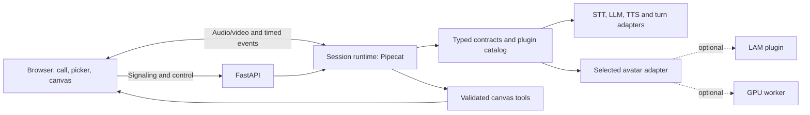

# OpenTavus design

Updated 3 October 2026. This is the implementation baseline for the full first release, with an earlier local alpha now implemented. [Tasks](tasks.json) record work and evidence. The user's requirements and preview choices are recorded in [decisions](decisions.md). The alpha does not complete the full v0.1 quality gates.

## Implemented local alpha

The current application combines a local call, independent model/voice/character settings, and a shared teaching board. It uses FastAPI, a framework-free core, a session runtime, React/Vite, Pipecat SmallWebRTC/Silero/segmented STT for microphone input, local Ollama Qwen2.5, CPU Whisper tiny, and Kokoro ONNX. Model artifacts and selected voice terms are pinned in [the model matrix](models.md). Setup is explicit; the default development install does not include model packages or weights.

Output PCM, captions, mouth cues and companion energy use one browser AudioWorklet sample clock. Generations cancel server production and reject late browser output; browser stop/progress acknowledgements constrain buffering. At most roughly two seconds of server audio and 64 browser packets can be queued. Complete acknowledged phrases enter the next-turn context; incomplete phrases are omitted because this model path has no word timing. The visible transcript shows a phrase when its playback starts and marks interrupted replies.

Mira's photographic mode uses prepared facial/head frames, controlled expressions and blinking through browser Canvas 2D. Static Mira, a curated CC0 stock 3D human, and the original stylized Orbit/Lumen remain independent choices. Photographic Mira consumes Kokoro phoneme cues; untimed engines and other characters retain played-energy animation. GLB/VRM imports, live neural portrait video, natural emotional behavior, LAM, Smart Turn, GPU workers, remote endpoints, and Internet hosting have separate acceptance work. Full T05 still requires compatible custom import and its contract evidence. Timed cue scheduling is separate from perceptual phoneme accuracy.

The teaching planner obtains schema-constrained JSON, then validates a fixed note/formula/diagram/quiz/clear allowlist again. Notes are Excalidraw text. Safe formula/diagram cards and quiz panels appear above the drawings. A browser operation acknowledgement gates the subsequent spoken board explanation. Explicit formula, diagram and quiz requests each use a single-tool provider schema: a real small-model trial returned a formula in place of a quiz with the union schema. Requested results are all validated before applying them. Their browser acknowledgements gate speech, which adds visible delay; the full timing strategy remains to be optimized and measured. Quiz answers match the exact text of a distinct choice. Unheard reply text stays out of history; temporary interruption notes provide model turn boundaries when no complete phrase was heard.

The API is loopback-only, admits one browser call, validates origins/hosts/settings, and requires a scoped call token in a socket hello or HTTP Authorization header. Tokens are not placed in URLs. Prepared calls with no socket expire. Call context lives in memory and is discarded on close; transcripts/recordings are not written by default. Versioned browser storage retains settings and drawings; lesson cards remain page-session state. There is no SQLite persona/asset database in this preview.

The current commands, limitations, and hardware evidence are in [the quickstart](quickstarts/local.md) and [alpha release notes](releases/0.1.0-alpha.1.md). The following sections retain the full v0.1 direction; they must not be read as a claim that every listed feature is shipped.

## Automatic drawing and Mac portrait follow-up

Explicit drawing requests work with teaching mode off, including plural names and
fragmented speech. The planner receives the latest request plus at most six recent
dialogue turns, with each message bounded to 2,000 characters. At most eight
successfully acknowledged board results enter later explanation context. This is
history of applied tools; the agent cannot inspect the user's drawings.

For the initial small-model flowchart, the private generation schema contains a
process title, inputs and outputs. The runtime compiles quoted Mermaid labels and
consistent connections. The public diagram event remains Mermaid. This narrower
format replaced a graph schema after real runs omitted products or reversed arrows;
arbitrary branching graphs still require a separate capable generator and evidence.
Mermaid's root `htmlLabels: false` keeps SVG text visible through the strict
sanitizer. Deprecated flowchart-only settings failed in the installed Mermaid
11.17 renderer. Browser checks verify labels and connections as well as tool ACKs.

The user chose realistic portrait/video and asked to try the Mac graphics hardware
first. T20's isolated native MLX MuseTalk trial generated actual frames on M3 Pro,
but its 5.3 FPS failed the fixed 25 FPS target. The original characters remain explicitly
labeled Cartoon preview. [The experiment](../benchmarks/portrait/mac/README.md)
records pinned artifacts, component gaps and unverified live timing/visual gates.
It installs no default plugin, and it does not replace full T10 acceptance.

T21's trusted stock renderer lazily imports Three.js, verifies a locally bundled
4.7 MB GLB, rejects external buffers/images/decoder extensions, and renders at
384 × 384 with a 30 FPS cap. Stop immediately closes its jaw from the shared
playout signal. Abort, context loss and character changes release its resources;
an asset or WebGL 2 failure shows a static poster while the call continues. Its
five-second M3 Pro cadence and real speech/Stop checks are bounded preview proof,
not a low-spec PC or 20-minute quality run. The user rejected this 3D appearance
as the realism goal. T22 instead prepares actual photographic face motion with
the pinned MIT LivePortrait core, excluding InsightFace/landmark weights and
actor/driving media. The selected fictional source is a one-time OpenAI image
creation explicitly requested by the owner; a pinned Apache-2.0 FLUX.2 Klein 4B
source and recipe remain available. This exception is disclosed rather than
calling OpenAI's model open source. Generation/preparation stays outside live
audio and the default installation.

The trusted photographic renderer loads four hash-checked local WebP sheets,
about 5.5 MB with the poster, and releases all four ImageBitmaps on disposal.
Native 512 × 512 tiles retain the preparation model's output resolution, capped
at 30 FPS during ordinary articulation, with approximately 144 MiB of decoded
sheet data plus small compositing masks. Four gently varying head poses, eight mouth
shapes and blink keys per expression form a finite motion bank. Each draw uses one coherent head pose rather than crossfading facial photographs.
Speech replaces a softly masked mouth region without whole-face fades. Eye
blinks remain independent. Their four prepared keys play in sequential 50 ms
stages, closing once before reopening; they are not indexed by a sine amplitude. Static mode needs only the poster.

Kokoro's pinned export returns phoneme durations with its waveform. The local
adapter maps IPA to closed/open/wide/round/pucker/teeth/tongue shapes, carries
stress and length marks into their vowels, fills pauses, and clips cues into each
80 ms PCM packet. Validated spans use packet-relative sample offsets; the runtime
rebases audio presentation time without shifting those offsets. The same Worklet
resamples and plays PCM and emits mouth changes when their samples are played.
There is no separate speech/animation queue. Empty cues explicitly use energy
animation; they never imply timing proof. Reset purges PCM and cues together and
rejects old generations. Stop closes immediately. Ordinary speech drawing targets
30 FPS and at most 80 ms from Worklet cue receipt to completed Canvas draw.
These are scheduling targets, not a DAC/acoustic or anatomical accuracy claim.

Neutral, warm, attentive and thoughtful cues describe the companion's own
presentation; they do not infer the user's emotions. Typed `deliveryFor()` selects
delivery from a played caption; runtime status supplies thinking/listening cues.
Reduced motion disables idle head movement/blinking while preserving articulation.
Failure or cancellation releases partial preparation and uses the static poster
without replacing the call. T22's earlier energy-only measurement remains
historical; T23's [timed portrait evidence](releases/phoneme-portrait-evidence.json)
records current measurements and the remaining visual/long-call/platform limits.
Prepared motion is not unrestricted live video or demonstrated Tavus equivalence.

## Outcome and product promise

A person can start a self-hosted avatar call, speak naturally, interrupt the reply, choose configured models/voices, and learn from a shared canvas while the agent talks. Humans and coding agents can add an engine or improve a feature through documented boundaries without changing unrelated modules.

The application will use Apache-2.0 code and provide a complete profile using reviewed permissive, downloadable model weights. Optional adapters expose their own component/asset terms. Software features are free; rented hardware is a separate expense. “Open-source application” does not imply that all upstream training data is published or that every hosted endpoint's model can be independently verified.

The user explicitly requested removable LAM support, several compelling launch features, fast progress, responsive interaction, accurate licensing, and easy contributions. The exact launch implementations below are engineering choices to validate. Later milestones retain the broader original vision.

## Launch experiences

### 1. Responsive avatar conversation

One call page provides a character, streamed speech, live transcript, microphone controls, connection/readiness state, and clear AI disclosure. The agent responds to pauses and interruptions without talking over a correction or replaying an abandoned answer. Mic access is required for spoken input; typed input works without it. Camera access is requested only when a future vision feature is enabled.

The base uses a redistributable, compatible stock GLB. A prepared-avatar importer accepts the supported GLB contract and reports missing rig/shapes; arbitrary VRM conversion follows its own validation work. A GPU portrait plugin adds higher-fidelity lip-sync on measured hardware. LAM adds separately eligible animation and photo-creation capabilities.

The conversation works when an optional avatar fails. Show the failed capability and let the user continue with another installed avatar or audio. Apply the user's choice explicitly; preserve persona, model, voice, and conversation history. Publish screenshots and real captured calls for the completed paths.

### 2. Model, voice, and character picker

A small settings panel lists **installed/configured** STT, LLM, TTS, voice, and avatar choices. Each choice shows its language/capabilities, license eligibility, hardware requirement, and ready/unavailable reason. The user can select a local profile or a reviewed GPU/split profile without editing the other components.

v0.1 implements a curated working set, not every model in the research catalog. The alpha uses Whisper tiny, reviewed Qwen2.5 0.5B/1.5B configurations through Ollama, Kokoro, and Silero VAD. Qwen 7B is a catalog option without live reference-machine evidence. Smart Turn and stronger/alternative models require their own measured integration. Extra adapters enter the catalog only with manifests and contract evidence. The initial English profile and additional languages have separate quality results. Exact revisions and runtime versions are selected in T01 and the model matrix.

Settings take effect on the next call. Resolve the entire profile, licenses, capabilities, and available memory before starting; return actionable errors instead of starting a half-configured session. Keep server secrets outside browser payloads. Source findings: [research review](plan-review.md).

### 3. Tutor canvas during the call

Bring the teaching experience into v0.1. Embed Excalidraw for user strokes and agent-authored elements. The agent can add a note, render a formula, draw a diagram, and show a practice question using a fixed tool set. It can refer to those results while speaking. Users can edit/draw and export the board; their changes survive agent updates and interruptions.

Use text elements for notes. Render KaTeX formulas and Mermaid diagrams as safe visual assets with an accessible text/source representation. Keep questions and answers as a structured panel beside the board. This avoids assuming formulas, arbitrary interactive widgets, and diagram source are native Excalidraw elements. Sources: [Excalidraw](https://github.com/excalidraw/excalidraw), [Excalidraw API](https://docs.excalidraw.com/docs/@excalidraw/excalidraw/api/props/).

Tools are `canvas_note`, `canvas_formula`, `canvas_diagram`, `canvas_quiz`, and `canvas_remove_agent_elements`. Validate bounded arguments and workspace ownership. Model output is data, not executable code. Keep Mermaid strict, disable HTML labels/remote links, and bound diagram size; keep KaTeX `trust: false` and limit expansion/size. Verify actual rendered output and sanitizer behavior against malicious fixtures. Sources: [Mermaid configuration](https://mermaid.js.org/config/schema-docs/config.html), [KaTeX security](https://katex.org/docs/security.html).

Every operation has an idempotency key, conversation ID, generation ID, and element IDs owned by the agent. Reject obsolete generation operations before applying them. A cancelled reply leaves an already displayed explanation available and marked partial; it does not erase user strokes. Clearing affects only agent-owned elements. Tool results enter the conversation context before the model claims success. Commit visual updates at the related speech segment's playback event; declare and test the chosen timing strategy in T08.

### 4. Optional portrait path

Keep LAM and one GPU portrait candidate inside the launch roadmap. Installation, artifact eligibility, supported assets, and quality are independently reported. The permissive base has no mandatory LAM dependency. A GPU preview becomes advertised only when its component licenses and actual first-frame/interruption behavior pass. A failed candidate stays visibly experimental/unavailable, with measured evidence; it cannot substitute for the three required launch experiences.

Candidate evaluation order: MuseTalk first; FlashHead Lite next if a complete review clears its bundled VAE and other artifacts. Compare visual identity, jitter, lip-sync, first playable frame, sustained performance, and memory. Do not infer whole-call capacity from avatar-only FPS. Source evidence: [review](plan-review.md). LAM behavior is specified in [the plugin contract](plugin-contract.md).

## Architecture and ownership

Start with a modular monolith. Use Pipecat for pipeline frames/streaming and interruption facilities, FastAPI for the control API, SQLite/local storage for session/persona/board metadata, and React/Vite/TypeScript for the browser. The LLM can run in an existing local server. Put a GPU adapter into an isolated process/container when its dependencies or compute would interfere with the app.

Code responsibility (implemented core/runtime/API/web/local adapters; workers and portrait plugins follow their tasks):

| Path | Owns | Dependency rule |
| --- | --- | --- |
| `packages/core/src/opentavus_core/` | Typed events, engine/asset specs, profile validation, pure policies | No app/framework/model imports |
| `packages/runtime/src/opentavus_runtime/` | Session lifecycle, Pipecat integration, generations, tool dispatch, timing | Imports core and constructed adapter interfaces |
| `apps/api/src/opentavus_api/` | HTTP/signaling, resource authorization, persistence, composition root | Constructs runtime and selected adapters |
| `apps/web/src/` | Call controls, settings, canvas, common playout integration | Uses API/event contracts and renderer interface |
| `plugins/<kind>/<name>/` | Adapter, manifest, model dependencies, examples, tests; renderer subpackage for browser avatars | Imports core; UI code depends on renderer contract |
| `workers/` | Isolated engine hosting and later worker protocol | Runs selected plugin; shares versioned core messages |
| `tests/` | Contract suites, deterministic replay, browser integration | Base tests use fixtures and need no paid service/GPU |
| `benchmarks/` | Real-model/browser timing harness and redistributable cases | Records complete run configuration and raw results |

Create later modules when their tasks start. Use Python protocols/dataclasses and typed TypeScript discriminated events at boundaries; use Pydantic at configuration/API boundaries. Keep separate STT, LLM, TTS, avatar, and image-job interfaces with one small common descriptor. Avoid a universal engine class containing every optional operation. Core controls lifecycle/cancellation, while plugins implement model behavior.

Python packaging uses a `uv` workspace; the browser uses an npm workspace and committed lockfile. Base installation includes only its selected lightweight dependencies. Plugin dependency groups/packages are explicit. Use Python entry points for installed adapter factories, but inspect manifests and eligibility before importing factories or heavyweight ML modules. Browser renderers use a trusted build-time registry with lazy imports; runtime metadata cannot cause downloads/execution of arbitrary JavaScript.

## Session and media behavior

Session states are `created`, `preparing`, `ready`, `active`, `ending`, `ended`, and `failed`. Only one transition owner mutates session state. Create a fresh generation ID for each answer. Attach it to tokens, audio, animation, canvas operations, and playout acknowledgements. Ignore stale output after an interruption, even if a backend finishes computation later.

Use bounded buffering, deadline-aware stages, off-event-loop inference, incremental STT/finalization, token/phrase TTS streaming, a non-thinking low-latency LLM configuration, and short spoken answers by default. Store the transcript of what was actually played, with an interrupted/partial marker. Keep longer material on the board rather than forcing a long spoken response.

T04 runs a bounded media-route comparison: WebRTC audio with animation aligned to playout versus scheduled PCM with animation on one AudioWorklet clock. Choose by echo behavior, interruption, jitter/underruns, sync, and observed browser latency. Once chosen, use one shared playout implementation through the renderer contract. This decision can change after measured evidence; it is not a second permanent playback mode to maintain.

Measure actual useful output, not canned acknowledgements or silence. A subtle listening/working indicator communicates state, but is not counted as a faster answer. Warm models and prebuilt avatar assets before marking the call ready. Surface long cold starts and missing downloads before connection.

SmallWebRTC handles the initial single-user transport. Any advertised cross-network profile includes signaling, HTTPS, and tested STUN/TURN, regardless of whether LiveKit is installed. Sources: [SmallWebRTC](https://docs.pipecat.ai/api-reference/server/services/transport/small-webrtc). Model clocks on different machines are not directly compared; use sample-index timebases and measured transport timing. Detailed targets: [quality gates](quality.md).

## API, persistence, and tools

The launch control API provides persona/configuration selection, avatar asset metadata, installed engine/capability catalog, conversation create/end/status, signaling, transcript/board snapshot retrieval, and session event delivery. Generate the TypeScript client from the API schema once stable. Bind the local profile to loopback and validate allowed browser origins; exposing it beyond the host uses the separately verified network profile. Return a conversation URL with short-lived session authorization for accessible deployments; browser code does not receive server API secrets.

Separate personas, voices, and avatar assets. Store an asset reference, format/version, plugin ID, consent/attribution record, and creation provenance. Keep plugin-specific data in its validated metadata namespace. SQLite is sufficient for the first single-host app. Version schema migrations and explicitly configured transcript retention/deletion; recordings are off until their dedicated task adds consent and provenance.

Resource and tool authorization is scoped to the active session. The launch canvas tools need no shell, arbitrary file, or external network access. Later general tools use an allowlist, bounded arguments, permissions, timeouts, and results recorded against the generation that invoked them. Future webhooks and remote URLs require destination validation as part of their own task.

## Delivery and release

Move quickly through working vertical slices: voice proof, reliable playback/cancellation, stock avatar, picker and canvas, optional portrait plugins, packaging, then public demonstration. After core contracts stabilize, picker, canvas, plugin integration, and quality work have distinct owners and can proceed independently.

The launch release requires all three primary experiences and their [quality gates](quality.md). A validated local profile is sufficient; remote-worker infrastructure does not block that release. Optional GPU/LAM capabilities and cross-network deployments are advertised according to their actual eligibility and results. Broad OS/model claims follow measured profiles; a build alone does not establish live support. Publish raw benchmark context and explicit hardware requirements.

Further milestones add consented voice/appearance creation, document-grounded tutoring, vision/screen input, general MCP tools, recordings/offline avatar-video jobs, and larger worker/LiveKit deployments. Keep the architecture open to them without implementing their scheduling, storage, and authentication infrastructure before those tasks need it.
