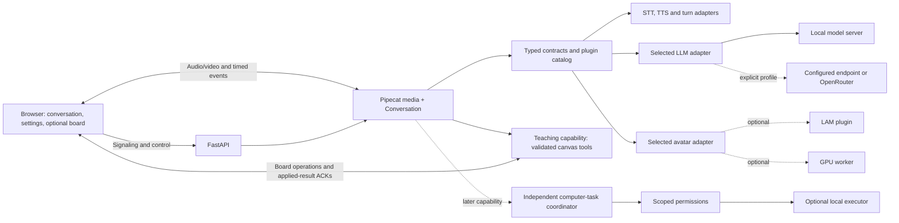

# OpenTavus design

Updated 5 October 2026. Read [the product plan](product-plan.md) for the first
product, delivery order and later assistant scope. This document defines the
architecture. [Tasks](tasks.json) record assignments and evidence; [decisions](decisions.md)
record the user's requirements and engineering choices. The local alpha does not
complete the first product's quality gates.

## Outcome and product promise

A person can talk naturally with a realistic photographic AI human, interrupt
and correct it, and choose its model/voice/character independently. Human–AI
interaction is the core product. Teaching with notes, formulas, diagrams and
practice on a shared board is the first optional capability. The same interaction
can use a reviewed local model or an explicitly configured hosted/compatible LLM.
Later, permission-controlled computer assistance adds another capability. Humans
and coding agents contribute through the same documented boundaries.

The application uses Apache-2.0 code and retains a complete reviewed open-model,
self-hosted profile. The user additionally authorizes optional hosted LLMs and
gateways with supplied credentials. Explicit provider choices declare model/
service terms, data destinations and usage costs; opaque hosted identity remains
provider-declared. Optional model/asset terms remain separate. The application
being open source does not establish that every configured model is open.

The user explicitly requested removable LAM support, several compelling launch features, fast progress, responsive interaction, accurate licensing, and easy contributions. The exact launch implementations below are engineering choices to validate. Later milestones retain the broader original vision.

## Launch experiences

### 1. Natural human–AI conversation

One call page provides a realistic photographic human, streamed speech, live
transcript, microphone controls, readiness and clear AI disclosure. The target is
interaction that feels like a human conversation: coherent facial movement,
speech/prosody, listening, pauses, interruptions and follow-ups. T29 evaluates
that ambition with human review and actual media; it is not an automatic claim
of indistinguishability. Mic access is required for spoken input; typed input works
without it. Camera access belongs to an explicitly selected future vision feature.

The first-product candidate is the curated photographic renderer, using the shared
played-audio clock. Evaluate actual articulation, gaze/blinking, expression,
identity and sustained behavior; a finite bank is a candidate, not full naturalness
proof. A higher-fidelity live portrait worker is optional when required by the
selected profile and supported by evidence. Static, 3D and cartoon modes retain
their accurate labels. Custom GLB/VRM imports are later T31 work, and removable
LAM is later T06 work; neither blocks the first interaction release.

Ordinary conversation works without a tutor persona or an open board. The active
persona/instructions and selected capabilities shape the help it provides; an
unavailable teaching tool does not make a conversation-only model unusable.
Teaching failure is a capability error, while failed speech/reasoning preparation
is a core call error. Keep these states distinct in the UI and runtime.

The conversation works when an optional avatar fails. Show the failed capability and let the user continue with another installed avatar or audio. Apply the user's choice explicitly; preserve persona, model, voice, and conversation history. Publish screenshots and real captured calls for the completed paths.

### 2. Model, voice, and character picker

A small settings panel lists **installed/configured** provider, model, STT, TTS,
voice and avatar choices. Each shows capabilities, terms/provenance, local hardware
or hosted connectivity/credential needs, and an actionable availability state.
The local and endpoint/hosted LLM profiles share speech and face behavior. Teaching
is advertised separately when the selected route supports its validated output.

v0.1 implements a curated working set, not every model in the research catalog. The alpha uses Whisper tiny, reviewed Qwen2.5 0.5B/1.5B configurations through Ollama, Kokoro, and Silero VAD. Qwen 7B is a catalog option without live reference-machine evidence. Smart Turn and stronger/alternative models require their own measured integration. Extra adapters enter the catalog only with manifests and contract evidence. The initial English profile and additional languages have separate quality results. Exact revisions and runtime versions are selected in T01 and the model matrix.

T28 adds a configured compatible/self-hosted endpoint and an explicit OpenRouter
route through [the provider boundary](provider-contract.md). Native provider data
stays inside adapters. Reuse `LanguageModel` and the existing schema-directed
teaching seam; extract a framework-free planning protocol when its second
implementation needs it. OpenCode is a separate optional agent bridge under later
assistant work, rather than a required model gateway for conversation.

Settings take effect on the next call. Resolve the full profile, capabilities,
eligibility or explicit external-service policy, secrets and resources before
starting. Keep keys in server configuration/secret storage, with no key values in
browser catalog/saved profiles. Hosted routing, costs and context transmission
are explicit choices. Return actionable errors instead of half-started calls.

### 3. Teaching as the first optional capability

Bring the teaching experience into v0.1. Embed Excalidraw for user strokes and agent-authored elements. The agent can add a note, render a formula, draw a diagram, and show a practice question using a fixed tool set. It can refer to those results while speaking. Users can edit/draw and export the board; their changes survive agent updates and interruptions.

The board opens when teaching is selected or requested. Ordinary calls do not
require lessons, quizzes or diagrams. The release demonstrates teaching as its
first useful capability alongside the independent interaction core; it does not
make every persona a tutor or every model a teaching backend.

Use the selected backend for both answers and bounded teaching proposals. Validate
locally, apply through the existing board dispatcher and await its acknowledgement.
T08 extends process-only diagrams to tested labeled relationships and branching
cases on capable routes, with reviewed factual results. Keep current structured
board revisions/results in follow-up context; don't assume deleted or edited
content is unchanged. Interpreting arbitrary learner handwriting/images is a
separate future perception capability.

Use text elements for notes. Render KaTeX formulas and Mermaid diagrams as safe visual assets with an accessible text/source representation. Keep questions and answers as a structured panel beside the board. This avoids assuming formulas, arbitrary interactive widgets, and diagram source are native Excalidraw elements. Sources: [Excalidraw](https://github.com/excalidraw/excalidraw), [Excalidraw API](https://docs.excalidraw.com/docs/@excalidraw/excalidraw/api/props/).

Tools are `canvas_note`, `canvas_formula`, `canvas_diagram`, `canvas_quiz`, and `canvas_remove_agent_elements`. Validate bounded arguments and workspace ownership. Model output is data, not executable code. Keep Mermaid strict, disable HTML labels/remote links, and bound diagram size; keep KaTeX `trust: false` and limit expansion/size. Verify actual rendered output and sanitizer behavior against malicious fixtures. Sources: [Mermaid configuration](https://mermaid.js.org/config/schema-docs/config.html), [KaTeX security](https://katex.org/docs/security.html).

Every operation has an idempotency key, conversation ID, generation ID, and element IDs owned by the agent. Reject obsolete generation operations before applying them. A cancelled reply leaves an already displayed explanation available and marked partial; it does not erase user strokes. Clearing affects only agent-owned elements. Tool results enter the conversation context before the model claims success. Commit visual updates at the related speech segment's playback event; declare and test the chosen timing strategy in T08.

### 4. Optional rendering and creation extensions

Photographic realism is a core first-product quality requirement. Higher-fidelity GPU
rendering is an optional implementation for a selected measured profile; LAM and
custom asset creation/import are later extensions. Report installation, artifact
eligibility and quality per capability. A GPU preview is advertised only after its
licenses and actual timing/interruption/visual gates pass. A failed candidate
stays experimental/unavailable and does not satisfy the interaction realism gate.

Earlier MuseTalk/FlashHead candidate ordering is historical research. Evaluate a
new candidate when the measured photographic quality gap requires it. Compare
identity, articulation, jitter, first playable frame, sustained performance and
memory; whole-call capacity requires a full call. Source context: [review](plan-review.md).
LAM behavior remains specified in [the plugin contract](plugin-contract.md).

## Architecture and ownership

Keep a modular monolith: framework-free core contracts, one `Conversation` owner,
Pipecat media integration, FastAPI composition/control and React/Vite UI. Construct
selected local/hosted adapters at the composition root. Use versioned browser
storage for existing settings/drawings and server-held provider configuration;
add a database when actual retention or multi-user requirements need it. Isolate
heavy avatar inference or later computer executors when dependencies/compute
would interfere with live interaction.

Code responsibility (implemented core/runtime/API/web/local adapters; workers and portrait plugins follow their tasks):

| Path | Owns | Dependency rule |
| --- | --- | --- |
| `packages/core/src/opentavus_core/` | Typed events, engine/asset specs, profile validation, pure policies | No app/framework/model imports |
| `packages/runtime/src/opentavus_runtime/` | Session lifecycle, Pipecat integration, generations, tool dispatch, timing | Imports core and constructed adapter interfaces |
| `apps/api/src/opentavus_api/` | HTTP/signaling, resource authorization, persistence, composition root | Constructs runtime and selected adapters |
| `apps/web/src/` | Call controls, settings, canvas, common playout integration | Uses API/event contracts and renderer interface |
| `plugins/<kind>/<name>/` | Adapter, manifest, model dependencies, examples, tests; renderer subpackage for browser avatars | Imports core; UI code depends on renderer contract |
| `workers/` | Isolated engine hosting and later worker protocol | Runs selected plugin; shares versioned core messages |
| `tests/` | Contract suites, deterministic replay, browser integration | Base tests use fixtures and need no paid service/GPU |
| `benchmarks/` | Real-model/browser timing harness and redistributable cases | Records complete run configuration and raw results |

Create later modules when their tasks start. Use Python protocols/dataclasses and
typed TypeScript events; validate untrusted configuration/events with Pydantic and
the generated schemas. Keep focused STT, LLM/planning, TTS, avatar and image-job
contracts. Provider HTTP/SDK types stay in adapters. Inject resources explicitly,
give each task/queue/clock one owner and bound work by time and size. Add shared
abstractions for actual second implementations. Tool proposals are data; the
application owns validation, authorization, dispatch and verified results.

Keep the interaction lifecycle independent of functional roles. A capability
declares its availability, validated input/output, permission scope and failure/
cancellation behavior. The current teaching allowlist is one concrete boundary;
T30 later adds actions with a different lifecycle. Introduce a shared capability
descriptor/registry only when that second implementation needs it, preserving
the existing conversation and renderer contracts. Avoid a universal executor
or a second orchestration framework for each function.

Python packaging uses a `uv` workspace; the browser uses an npm workspace and committed lockfile. Base installation includes only its selected lightweight dependencies. Plugin dependency groups/packages are explicit. Use Python entry points for installed adapter factories, but inspect manifests and eligibility before importing factories or heavyweight ML modules. Browser renderers use a trusted build-time registry with lazy imports; runtime metadata cannot cause downloads/execution of arbitrary JavaScript.

## Session and media behavior

Session states are `created`, `preparing`, `ready`, `active`, `ending`, `ended`, and `failed`. Only one transition owner mutates session state. Create a fresh generation ID for each answer. Attach it to tokens, audio, animation, canvas operations, and playout acknowledgements. Ignore stale output after an interruption, even if a backend finishes computation later.

Use bounded buffering, deadline-aware stages, off-event-loop inference, incremental STT/finalization, token/phrase TTS streaming, a non-thinking low-latency LLM configuration, and short spoken answers by default. Store the transcript of what was actually played, with an interrupted/partial marker. Keep longer material on the board rather than forcing a long spoken response.

T04 runs a bounded media-route comparison: WebRTC audio with animation aligned to playout versus scheduled PCM with animation on one AudioWorklet clock. Choose by echo behavior, interruption, jitter/underruns, sync, and observed browser latency. Once chosen, use one shared playout implementation through the renderer contract. This decision can change after measured evidence; it is not a second permanent playback mode to maintain.

Measure actual useful output, not canned acknowledgements or silence. A subtle listening/working indicator communicates state, but is not counted as a faster answer. Warm models and prebuilt avatar assets before marking the call ready. Surface long cold starts and missing downloads before connection.

SmallWebRTC handles the current single-user microphone transport. T25's
[transport review](transport-review.md) selects self-hosted LiveKit through the
existing Pipecat adapter as the preferred deployed-call candidate. T26 runs an
early optional comparison of SmallWebRTC output, LiveKit tracks/data and the
current PCM/AudioWorklet route before T17 room scaling. It reuses the local models,
teaching tools and one conversation owner. An initial input-only hybrid preserves
the output clock while isolating failures; adoption requires receiver playback,
generation/board acknowledgements, cleanup and a recorded simplicity comparison.
LiveKit Server and the Agents framework are separate choices; the transport trial
adds no second agent pipeline. The normal local profile keeps its current setup
while this experiment is unexecuted.

Any advertised cross-network profile includes signaling, HTTPS, and tested
STUN/TURN under T11, regardless of whether LiveKit is installed. Sources:
[SmallWebRTC](https://docs.pipecat.ai/api-reference/server/services/transport/small-webrtc),
[Pipecat LiveKit](https://docs.pipecat.ai/api-reference/server/services/transport/livekit).
Model clocks on different machines are not directly compared; use sample-index
timebases and measured receiver timing. Detailed targets: [quality gates](quality.md).

## API, persistence, and tools

The launch control API provides persona/configuration selection, avatar asset metadata, installed engine/capability catalog, conversation create/end/status, signaling, transcript/board snapshot retrieval, and session event delivery. Generate the TypeScript client from the API schema once stable. Bind the local profile to loopback and validate allowed browser origins; exposing it beyond the host uses the separately verified network profile. Return a conversation URL with short-lived session authorization for accessible deployments; browser code does not receive server API secrets.

Separate personas, voices and avatar assets. Store versioned references, plugin
ID, consent/attribution and creation provenance when those persistence features
are implemented. Keep plugin-specific metadata validated. The current call stays
in memory and settings/drawings use browser storage. SQLite is an option when
persona/asset retention needs it, rather than a prerequisite for live tutoring.
Recordings and additional transcript retention stay off until their dedicated
tasks implement explicit policy, deletion and provenance.

Resource and teaching-tool authorization is scoped to the active session. The
launch canvas tools need no shell, arbitrary file or external network access.
Later computer actions use an allowlist, bounded arguments, permissions, timeouts
and durable task/action receipts. Their lifecycle is separate from the speech
generation that describes them. Future webhooks and remote URLs require
destination validation as part of their own task.

## Delivery and release

Move through the [product plan's slices](product-plan.md): pre-registered quality
baseline, selectable local/hosted reasoning, reliable speech/playback, realistic
human presentation, settings and the first teaching capability, then setup and public demonstration.
After contracts stabilize, feature and quality work have distinct scoped owners.

The launch release requires the first three experiences and their
[quality gates](quality.md), including a reviewed local profile and a configured
hosted LLM profile with separate live evidence. Remote-worker infrastructure does
not block the interaction release. Optional GPU/LAM capabilities and cross-network
deployments are advertised according to their actual eligibility and results.
Broad OS/model claims follow measured profiles; a build alone does not establish
live support. Publish raw benchmark context and explicit hardware requirements.

After the first interaction release, T30 adds [computer assistance](computer-use.md):
validated action proposals pass through scoped permissions to an optional local
executor. Its task/action lifecycle is separate from speech generations, and
observed receipts govern completion claims. OpenCode can supply an optional agent
bridge. Teaching remains an independent capability with no computer privileges.

Further milestones retain consented voice/appearance creation, document-grounded
tutoring, vision, MCP tools, compatible GLB/VRM imports, recording/offline video,
LAM and larger worker/room deployments. T26 compares transport; T17 scales rooms.
Keep these boundaries documented and implement modules when their tasks start.

## Current alpha and bounded experiment evidence

### Historical scientist portrayal (T24)

Albert Einstein is a curated photographic choice built from Ferdinand Schmutzer's
public-domain 1921 photograph, with the exact source and rights explanation in
[the asset provenance](../assets/stock/einstein/README.md). The monochrome source
is preserved. Open LivePortrait prepares controlled motion offline; its model
libraries and weights are absent from live browser playback. New settings select
Einstein and a Michael preset voice; valid saved model/voice/character choices
remain intact. Mira and the existing alternatives remain available.

Historical choices show **AI portrayal · Synthetic voice**. Their trusted identity
prompt describes a modern educational AI, encourages concrete thought experiments,
and excludes invented memories, quotations and endorsement. A picture and the
model's general knowledge are not a source-grounded historical dialogue system.
The voice remains independently selectable and is not cloned from the scientist.

One shared photographic renderer selects a trusted local bank, checks its identity,
geometry, file digests and dimensions, and uses the existing audio-clock cues.
Mouth/eye masks are reviewed per face. A static scientist choice and the failure
poster use that same scientist's asset. Only the selected bank's four sheets are
decoded; switching releases them. No arbitrary URL, custom-photo upload, new
speech queue or live inference path is introduced. Visual/speech evidence is
recorded separately from compilation in [the scientist evidence](releases/einstein-portrait-evidence.json); full natural human behavior remains open.

### Implemented local alpha

The current application combines a local call, independent model/voice/character settings, and a shared teaching board. It uses FastAPI, a framework-free core, a session runtime, React/Vite, Pipecat SmallWebRTC/Silero/segmented STT for microphone input, local Ollama Qwen2.5, CPU Whisper tiny, and Kokoro ONNX. Model artifacts and selected voice terms are pinned in [the model matrix](models.md). Setup is explicit; the default development install does not include model packages or weights.

Output PCM, captions, mouth cues and companion energy use one browser AudioWorklet sample clock. Generations cancel server production and reject late browser output; browser stop/progress acknowledgements constrain buffering. At most roughly two seconds of server audio and 64 browser packets can be queued. Complete acknowledged phrases enter the next-turn context; incomplete phrases are omitted because this model path has no word timing. The visible transcript shows a phrase when its playback starts and marks interrupted replies.

Einstein and Mira's photographic modes use prepared facial/head frames, controlled expressions and blinking through browser Canvas 2D. Static Mira, a curated CC0 stock 3D human, and the original stylized Orbit/Lumen remain independent choices. Photographic characters consume Kokoro phoneme cues; untimed engines and other characters retain played-energy animation. GLB/VRM imports, live neural portrait video, natural emotional behavior, LAM, Smart Turn, GPU workers, remote endpoints, and Internet hosting have separate acceptance work. T27 moves compatible custom import to later T31; T05 now owns photographic interaction quality evaluated through T29. Timed cue scheduling is separate from perceptual phoneme accuracy.

The teaching planner obtains schema-constrained JSON, then validates a fixed note/formula/diagram/quiz/clear allowlist again. Notes are Excalidraw text. Safe formula/diagram cards and quiz panels appear above the drawings. A browser operation acknowledgement gates the subsequent spoken board explanation. Explicit formula, diagram and quiz requests each use a single-tool provider schema: a real small-model trial returned a formula in place of a quiz with the union schema. Requested results are all validated before applying them. Their browser acknowledgements gate speech, which adds visible delay; the full timing strategy remains to be optimized and measured. Quiz answers match the exact text of a distinct choice. Unheard reply text stays out of history; temporary interruption notes provide model turn boundaries when no complete phrase was heard.

The API is loopback-only, admits one browser call, validates origins/hosts/settings, and requires a scoped call token in a socket hello or HTTP Authorization header. Tokens are not placed in URLs. Prepared calls with no socket expire. Call context lives in memory and is discarded on close; transcripts/recordings are not written by default. Versioned browser storage retains settings and drawings; lesson cards remain page-session state. There is no SQLite persona/asset database in this preview.

The current commands, limitations, and hardware evidence are in [the quickstart](quickstarts/local.md) and [alpha release notes](releases/0.1.0-alpha.1.md). The architecture and launch experiences above define the remaining v0.1 work; they are separate from the implemented alpha described here.

### Automatic drawing and Mac portrait follow-up

Explicit drawing requests work with teaching mode off, including plural names and
fragmented speech. The planner receives the latest request plus at most six recent
dialogue turns, with each message bounded to 2,000 characters. At most eight
successfully acknowledged board results enter later explanation context. This is
history of applied tools; the agent cannot inspect the user's drawings.

For the initial small-model flowchart, the private generation schema contains a
process title, inputs and outputs. The runtime compiles quoted Mermaid labels and
consistent connections. The public diagram event remains Mermaid. This narrower
format replaced a graph schema after real runs omitted products or reversed arrows;
arbitrary branching graphs still require a separate capable generator and evidence.
Mermaid's root `htmlLabels: false` keeps SVG text visible through the strict
sanitizer. Deprecated flowchart-only settings failed in the installed Mermaid
11.17 renderer. Browser checks verify labels and connections as well as tool ACKs.

The user chose realistic portrait/video and asked to try the Mac graphics hardware
first. T20's isolated native MLX MuseTalk trial generated actual frames on M3 Pro,
but its 5.3 FPS failed the fixed 25 FPS target. The original characters remain explicitly
labeled Cartoon preview. [The experiment](../benchmarks/portrait/mac/README.md)
records pinned artifacts, component gaps and unverified live timing/visual gates.
It installs no default plugin, and it does not replace full T10 acceptance.

T21's trusted stock renderer lazily imports Three.js, verifies a locally bundled
4.7 MB GLB, rejects external buffers/images/decoder extensions, and renders at
384 × 384 with a 30 FPS cap. Stop immediately closes its jaw from the shared
playout signal. Abort, context loss and character changes release its resources;
an asset or WebGL 2 failure shows a static poster while the call continues. Its
five-second M3 Pro cadence and real speech/Stop checks are bounded preview proof,
not a low-spec PC or 20-minute quality run. The user rejected this 3D appearance
as the realism goal. T22 instead prepares actual photographic face motion with
the pinned MIT LivePortrait core, excluding InsightFace/landmark weights and
actor/driving media. The selected fictional source is a one-time OpenAI image
creation explicitly requested by the owner; a pinned Apache-2.0 FLUX.2 Klein 4B
source and recipe remain available. This exception is disclosed rather than
calling OpenAI's model open source. Generation/preparation stays outside live
audio and the default installation.

The trusted photographic renderer loads four hash-checked local WebP sheets,
about 5.5 MB with the poster, and releases all four ImageBitmaps on disposal.
Native 512 × 512 tiles retain the preparation model's output resolution, capped
at 30 FPS during ordinary articulation, with approximately 144 MiB of decoded
sheet data plus small compositing masks. Four gently varying head poses, eight mouth
shapes and blink keys per expression form a finite motion bank. Each draw uses one coherent head pose rather than crossfading facial photographs.
Speech replaces a softly masked mouth region without whole-face fades. Eye
blinks remain independent. Their four prepared keys play in sequential 50 ms
stages, closing once before reopening; they are not indexed by a sine amplitude. Static mode needs only the poster.

Kokoro's pinned export returns phoneme durations with its waveform. The local
adapter maps IPA to closed/open/wide/round/pucker/teeth/tongue shapes, carries
stress and length marks into their vowels, fills pauses, and clips cues into each
80 ms PCM packet. Validated spans use packet-relative sample offsets; the runtime
rebases audio presentation time without shifting those offsets. The same Worklet
resamples and plays PCM and emits mouth changes when their samples are played.
There is no separate speech/animation queue. Empty cues explicitly use energy
animation; they never imply timing proof. Reset purges PCM and cues together and
rejects old generations. Stop closes immediately. Ordinary speech drawing targets
30 FPS and at most 80 ms from Worklet cue receipt to completed Canvas draw.
These are scheduling targets, not a DAC/acoustic or anatomical accuracy claim.

Neutral, warm, attentive and thoughtful cues describe the companion's own
presentation; they do not infer the user's emotions. Typed `deliveryFor()` selects
delivery from a played caption; runtime status supplies thinking/listening cues.
Reduced motion disables idle head movement/blinking while preserving articulation.
Failure or cancellation releases partial preparation and uses the static poster
without replacing the call. T22's earlier energy-only measurement remains
historical; T23's [timed portrait evidence](releases/phoneme-portrait-evidence.json)
records current measurements and the remaining visual/long-call/platform limits.
Prepared motion is not unrestricted live video or demonstrated Tavus equivalence.
