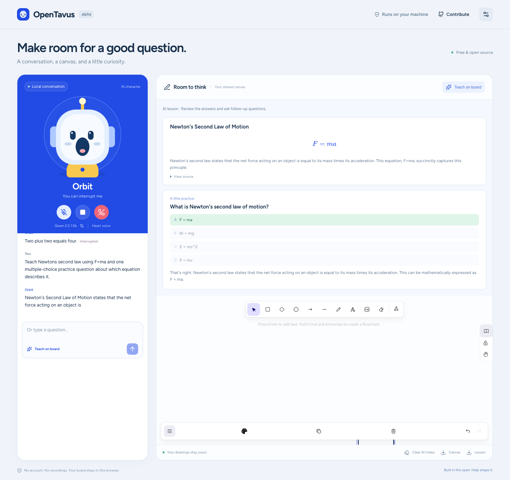

# OpenTavus 0.1.0-alpha.1

The first local product preview combines an animated AI conversation, independent language-model/voice/character settings, and a shared teaching board. Use [the quickstart](../quickstarts/local.md) to try it. It requires no hosted inference key or subscription.

This is a community alpha, not a declaration that the full v0.1 launch gates have passed. T18 records its bounded acceptance. T01/T03-T09 retain the broader incomplete requirements, and T13 remains open. The application binds to loopback and admits one active browser call.

## Included

- Local Qwen2.5 streaming replies through Ollama, Whisper tiny English transcription, and Kokoro ONNX speech.
- Original Orbit/Lumen animated companions whose mouth energy follows the browser's played audio.
- Typed questions without microphone access, microphone controls, live on-page transcript, and explicit Stop/end controls.
- Curated installed-model selection, four English preset voices, and independent character settings applied to the next call.
- A drawing canvas with AI notes, safe rendered formulas/flowcharts, interactive multiple-choice questions, preservation of user edits, and PNG/Markdown exports.
- Explicit model downloads with pinned revisions/digests, doctor/readiness guidance, and a build/test workflow that requires no models.
- Human/agent instructions, styles, contribution examples, conduct/governance/security reporting, and issue/PR templates.

## Verification boundary

Reference hardware: Apple M3 Pro, 18 GB RAM; Python 3.12.11, Node.js 26.8.2, Chrome 154. Runtime dependencies are committed in the lockfiles. The working model variants are Qwen2.5 1.5B and 0.5B, Whisper tiny CPU int8, and Kokoro's pinned float ONNX model. This machine also had substantial memory/swap pressure and little free disk space during development; small trial timings are not representative 100-turn percentiles.

The lightweight contributor suite checks the core, runtime/API with synthetic engines, safe tool input, cancellation/late callbacks, bounded queues, acknowledged history, browser Worklet source-sample progress/reset, drawing ownership, generated contracts, strict typing, styles, and production build. Real browser inference/selection and synthetic microphone evidence are recorded separately. The [run summary](0.1.0-alpha.1-evidence.json), [browser events](0.1.0-alpha.1-smoke-live-events.json), and [synthetic microphone events](0.1.0-alpha.1-smoke-microphone-events.json) record exact outcomes and limits. `make check` passed 60 Python tests, strict mypy over 25 sources, Ruff, generated schemas/types, TypeScript, ESLint/Prettier, production build, three contract tests and six web tests. `make demo` and isolated `make base-check` passed; base discovery found zero plugins. Both opt-in real Chrome checks passed.

The initial untuned browser path took about 20.8 seconds from a typed question to first Worklet caption and about 51.7 seconds for a serial teaching request. Those are observed slow trials, not accepted latency targets. Four-thread speech synthesis outperformed the one-thread variant in the named experiment; an int8 model experiment was slower and was rejected. The selected path bounds CPU threads and first-phrase length, disables idle spinning, warms models before ready, and reuses a bounded speech-engine pool. The final repeated warm arithmetic request took 2,543.8 ms from the typed request being sent to first Worklet caption. The equation lesson took 8,456.4 ms including planning and browser application; its two tools were acknowledged before speech. Local Stop-to-Worklet-reset observations were 15.2–15.8 ms. The synthetic microphone trial took 5,110.6 ms from final transcript to first caption, which excludes earlier capture/VAD/STT time. These are individual browser-clock observations, with prompt reuse/caching and concurrent machine load, rather than speaker-waveform timing or 100-turn percentiles. Cold preparation is separate.

An actual Newton's-law lesson rendered a correct formula and a practice question, with positive browser tool acknowledgements before speech. A separate generated inertia explanation contained a conceptual error; small-model factual quality remains a limitation. A stronger reviewed model/grounding contribution is valuable. Additional trials omitted a requested quiz, used answer letters/indices inconsistently, repeated an interrupted question, generated equivalent distractors, or replaced a numerical quiz with a definition question. Compact single-tool schemas supplied in both provider format and prompt, exact-choice validation, explicit model turn boundaries, and clearer question descriptions corrected the final bounded example. A numerical-request-following limitation remains open. Schema validation establishes safe structured rendering, not scientific correctness. The UI labels these as AI lessons for review.

The [exported example](0.1.0-alpha.1-example-lesson.md) comes from that real model/browser trial. Its question, choices, feedback, and spoken topic were inspected; this is one checked example, not a guarantee about later lessons.

## Still open

- P50 <= 800 ms / P95 <= 1.5 s over 100 representative spoken warm turns, spoken interruption recognition timing, natural pauses/Smart Turn, physical speaker echo, and the output-route comparison.
- Exact speaker waveform/phoneme lip-sync measurements, sustained frame-cadence proof, a 20-minute call, and 20 lifecycle/reconnect cycles.
- Additional hardware/OS/browser/language profiles. Linux CI builds/tests the source without proving Linux model performance.
- Persistent lesson cards, persona/asset storage, custom GLB/VRM avatars, LAM integration/removal after installation, photorealistic portraits, GPU workers, and Internet hosting.
- Voice cloning, vision, arbitrary MCP/network/file tools, recordings, and offline avatar-video production.

The base has no LAM or portrait dependency. The three trial experiences work without optional avatar packages. LAM's separate install/remove matrix and artifact terms remain future integration work. The software remains free; optional infrastructure costs and each model/runtime's terms are separate.

## Privacy and publication

Default diagnostics exclude transcript/audio/credentials. Call context is in memory and is dropped on end. The transcript stays on the page until refresh; settings and drawings use versioned local browser storage, while lesson cards last for the page session. No recording is saved by default. Export lessons/drawings before refresh. See [security](../../SECURITY.md) and [model/runtime notices](../../THIRD_PARTY_NOTICES.md).

Source publication and GitHub CI are recorded after the final reviewed commit. This release must be labeled a prerelease/alpha; do not tag it as stable v0.1 while the full quality gates remain open.
