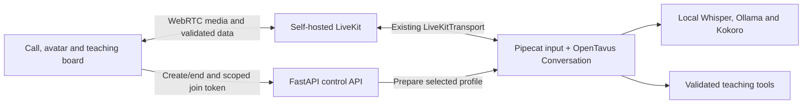

# Transport architecture review

Reviewed 2026-10-05 / T25. This is an architecture decision and a specification
for T26's trial. LiveKit is not installed or integrated in the current app.

## Recommendation

Keep Pipecat as the current conversation integration and evaluate **self-hosted
LiveKit through Pipecat's existing transport** for deployed calls. Keep the
SmallWebRTC local profile while the comparison runs. LiveKit is the preferred
networked candidate; adopting it depends on measured experience and maintenance
cost, not popularity or a room-join demonstration.

The user's requirements remain local/open inference, a removable avatar stack,
good interaction without NVIDIA, fast progress, and easy contributions. A media
server transports generated speech/video; avatar realism and model inference
speed still have their own requirements.

## What the current code actually does

| Responsibility | Current owner |
| --- | --- |
| Call admission, settings, preparation, scoped authorization, HTTP offer/answer | `apps/api/src/opentavus_api/app.py` |
| Microphone capture, manual peer/ICE setup and heartbeat | `apps/web/src/media/microphone.ts` |
| Incoming media, Silero VAD, segmented local STT | `packages/runtime/src/opentavus_runtime/webrtc.py`, using Pipecat SmallWebRTC |
| Answer generations, cancellation, heard history, model streaming, validated teaching tools | `packages/runtime/src/opentavus_runtime/conversation.py` |
| Typed events and acknowledgements | Current API WebSocket and `apps/web/src/features/call/useConversation.ts` |
| PCM playback, captions and phoneme cues on one sample clock | `apps/web/src/media/playout.ts` and `apps/web/public/playout-worklet.js` |
| Prepared portraits and user-owned drawings | Existing avatar/canvas features |

Pipecat currently owns the microphone pipeline. The separate `Conversation`
runtime owns generated answers and browser acknowledgements. Replacing the
transport does not automatically replace that orchestration or the output clock.
The API admits one call and binds to loopback. Neither Internet deployment nor
room reconnection is currently supported.

## Candidate comparison

These fit assessments are engineering judgments for this checkout, not measured
latency rankings.

| Candidate | What it supplies | Fit for OpenTavus |
| --- | --- | --- |
| Pipecat + SmallWebRTC | Direct browser-to-runtime WebRTC, including audio/video/data, without a separate room server | Simplest local setup. Already used for input; its track-based output remains a candidate in the media comparison. |
| Pipecat + self-hosted LiveKit | Room server, browser/server SDKs, media/data transport and participant events through an existing Pipecat adapter | Preferred deployed-call candidate. Reduces custom connection handling, but adds a server, room authorization and operational setup. |
| LiveKit Agents + self-hosted LiveKit | Transport plus an agent framework for STT/LLM/TTS, tools, turns and interruptions | Worth revisiting if orchestration remains a measured bottleneck. Migration must transfer the existing history, board and media contracts to one owner. |
| mediasoup | Low-level SFU integration with Node.js/C++ workers or Rust bindings | Useful for custom media infrastructure. More application-level integration work conflicts with this project's speed/simplicity goal. |

Primary sources: [SmallWebRTC](https://docs.pipecat.ai/api-reference/server/services/transport/small-webrtc),
[Pipecat LiveKit transport](https://docs.pipecat.ai/api-reference/server/services/transport/livekit),
[LiveKit Agents](https://docs.livekit.io/agents/), and
[mediasoup design](https://mediasoup.org/documentation/v3/mediasoup/design/).

LiveKit Server and LiveKit Agents are separate Apache-2.0 projects.
[Server source and license](https://github.com/livekit/livekit),
[Agents source and license](https://github.com/livekit/agents).
Self-hosting the server and agent processes is supported. Managed hosting,
Cloud inference and enhanced noise-cancellation products have distinct service
or model terms; selecting open-source transport does not approve every example
provider. Use our reviewed local Whisper/Ollama/Kokoro path in the trial.
[Self-hosting capabilities](https://docs.livekit.io/transport/self-hosting/).

## Bounded dependency review

The installed and locked Pipecat version is `pipecat-ai==1.12.0`. Its `livekit`
extra declares `livekit>=1.0.13,<2`, `livekit-api>=1.0.5,<2`,
`tenacity>=8.2.3,<10.0.0` and `pyjwt>=2.12.0,<3`.
The existing transport accepts `url`, `token`, `room_name` and `LiveKitParams`;
it supplies `input()`/`output()` and participant/data events.
[Versioned dependency source](https://github.com/pipecat-ai/pipecat/blob/v1.12.0/pyproject.toml),
[versioned transport source](https://github.com/pipecat-ai/pipecat/blob/v1.12.0/src/pipecat/transports/livekit/transport.py).

Local metadata inspection found no installed `livekit`, `livekit-api` or
`livekit-agents` distribution. Reading a transport's source does not establish
that its optional imports or a live connection work. T26 must pin the actual
server, Python and browser SDK versions/digests and review their transitive terms
before installation. Do not upgrade Pipecat or introduce the Agents SDK merely
to try a transport it already supplies.

The reviewed transport defaults its outgoing `AudioSource` queue to 1,000 ms
and clears that source on an `InterruptionFrame`. Server-source clearing cannot
acknowledge what a browser's receive/playback buffers actually played. T26 must
measure the receiver and retain our generation/history semantics. The installed
transport source SHA-256 was
`5bd567a9dbd1332ea9580d1cd4f6e28ad16b91cf564d114cdadfe27e48e5dda7`;
the trial should record the bytes it actually executes.

## Proposed deployed boundary

This is the intended boundary for the experiment, not the current wiring:

FastAPI keeps settings, preparation, call admission, token issuance and end-call
authorization. LiveKit owns rooms/connections and carries media/data. Our runtime
keeps model selection, teaching semantics, generations and heard-history policy.
Existing UI/avatar features consume validated events and the selected playback
clock. Initially one call has one opaque room and one authorized browser identity.
Moving an engine to a worker later remains T11; a LiveKit room is not an engine
job protocol or a capacity measurement.

Use one conversation/turn owner. A future Agents migration would replace the
relevant orchestration, with its acceptance cases ported; it would not run a
second STT/turn/TTS pipeline alongside `Conversation`.

## T26 trial sequence

1. **Comparable baseline.** Record current local and track-based SmallWebRTC
   behavior with the same models, inputs, browser, network conditions and warm-up.
   Inventory custom connection code, processes, dependencies and setup steps.
2. **Optional LiveKit input.** In an isolated trial profile, replace manual
   offer/answer and peer management with the SDK and Pipecat adapter. Reuse the
   same VAD/STT processors and `Conversation`. Keep existing PCM/ACK output during
   this first slice so transport and timing failures can be distinguished. This
   hybrid is temporary and does not establish architectural simplification.
   Extract the shared microphone processors from `webrtc.py` only as needed;
   the LiveKit path should not import SmallWebRTC/aiortc merely to reuse local STT.
3. **Full media comparison.** Exercise generated audio tracks and validated
   room data. Map phoneme/caption cues to receiver-observed playback with an
   explicit sample origin and documented uncertainty. Compare against the
   existing Worklet route and SmallWebRTC output. Source publication or packet
   arrival is insufficient playback evidence. Prove a single speech output path.
4. **Adoption result.** Record which deployment/media route wins and why in D08
   and D29. Remove the superseded output path in a coordinated change only when
   the replacement passes. If it fails timing, cleanup or simplicity, retain the
   local implementation and publish the failed measurements. Reconnection and
   Internet claims additionally require T11.

T26 runs before room scaling, with completed T02/T18/T25 dependencies. It does
not wait for a worker pool or force network infrastructure into the local release.
T04 owns the final media/cancellation decision. T17 owns later concurrent-room
capacity and operations. A second implementation should reveal the smallest
needed transport interface; avoid a universal plugin framework in advance.

## Data, timing and authorization requirements

Carry the current validated conversation/generation/utterance/sequence fields and
tool idempotency keys across the boundary. Explicitly authenticate the sender's
participant identity and session scope; a room topic or payload field is not
authorization. Keep agent tool events and browser acknowledgements as distinct
allowed directions.

LiveKit's reliable data packets are best effort, have a documented 15 KiB payload
limit, and are not retained by the server for disconnected receivers. Bound
encoded message sizes, use an appropriate bounded stream/RPC for larger data,
and retain tool acknowledgements with deadlines. After reconnect, request and
validate current state, discard obsolete generations, and reconcile applied
operation IDs while preserving user drawings. Do not replay unacknowledged audio
or call a successful send an applied board update.
[Packet delivery and size rules](https://docs.livekit.io/transport/data/packets/).

Generate short-lived, room-scoped join grants in FastAPI after existing call
authorization. Keep server secrets on the server and tokens out of logs/URLs.
Use opaque identities. Restrict the first browser grant to the required
microphone/data/subscription capabilities. Token expiry governs initial joins;
it does not itself end an active call or subsequent reconnect. Ending the call
must close admission, stop refreshing grants, disconnect participants and clean
up its uniquely owned room. Test rejoining with a still-valid token after end;
define and verify enforcement for the pinned self-hosted server.
[Tokens, grants and lifecycle](https://docs.livekit.io/frontends/reference/tokens-grants/).

Keep the experiment on loopback with explicit configuration and separately
installed optional dependencies. Keep base imports, model-free checks and the
normal local setup working with LiveKit absent. A network profile follows T11's
HTTPS, traversal, authentication and failure checks; dev-mode credentials are
not a published deployment profile.
[Local server setup](https://docs.livekit.io/transport/self-hosting/local/).

## Evidence needed for adoption

Use [the existing quality definitions](quality.md), recording failed turns and
the precise measurement boundaries. Compare:

| Boundary | Required observation |
| --- | --- |
| Useful latency | Actual last user speech sample to first useful played answer; separate cold start, STT, generation and media costs |
| Interruption | Old-generation audio, mouth and captions stop at the receiver; late output remains rejected; history contains only acknowledged playback |
| Synchronization | Phoneme/sample origin, receiver timing uncertainty, long-reply drift, actual audio/video capture and perceptual review |
| Board | Formula/diagram applied ACK precedes its spoken claim; duplicate/reconnected operations preserve user content |
| Lifecycle | Mute/autoplay/permission cases, partial initialization, server absence/loss, bounded reconnect, end-call admission, task/track/room cleanup |
| Network | Jitter/slow clients and dropped data; cross-network traversal is separately evidenced under T11 |
| Cost and simplicity | Runtime/model memory, media-server overhead, buffered milliseconds, dependencies/processes, setup steps and custom code removed/retained |
| Base independence | Model-free contributor/base checks and local operation with the optional transport absent |

Apply the same tests to candidates. A bounded trial reports its sample count;
the full launch gate remains 100 representative warm turns, a 20-minute call and
20 start/end/reconnect cycles with the published latency/stop/sync limits. A room
join, source inspection or CI pass cannot establish those properties.

## Review evidence and open work

T25 inspected the clean `a1f5e34` checkout, the actual API/microphone/runtime/
Worklet wiring, installed Pipecat metadata/source and the primary sources above.
It selected a candidate and specified an early, optional comparison. T26 remains
unexecuted: no LiveKit server, room, local-model call, output clock, latency or
Internet support has been validated by this review.
